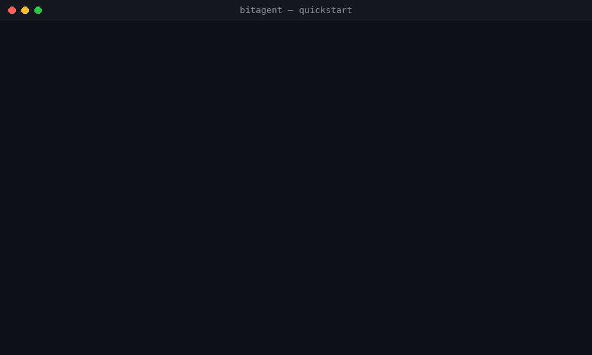
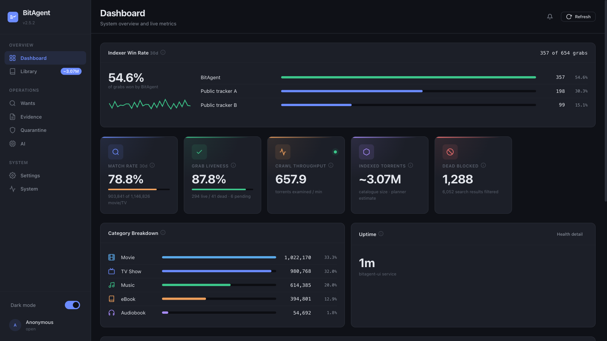
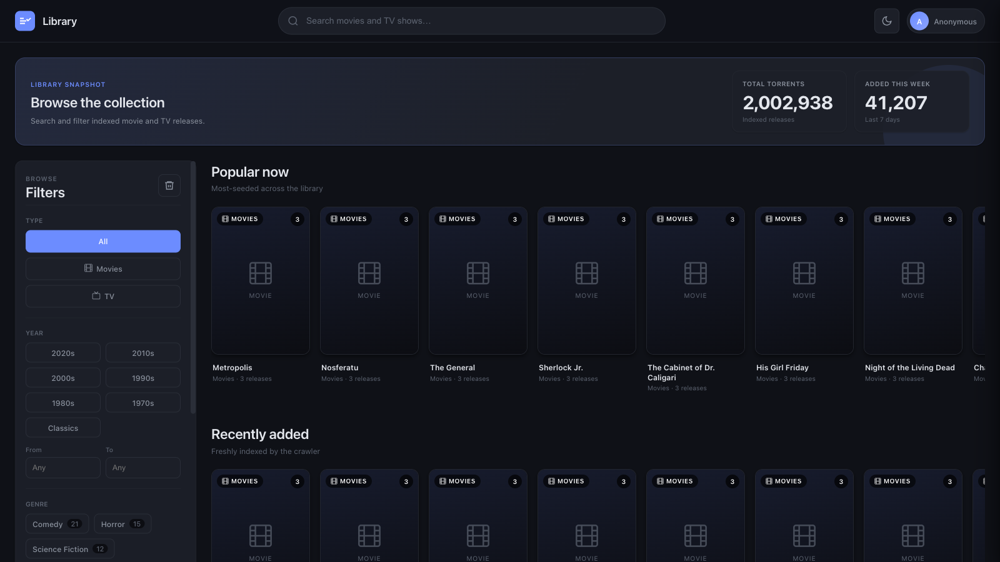
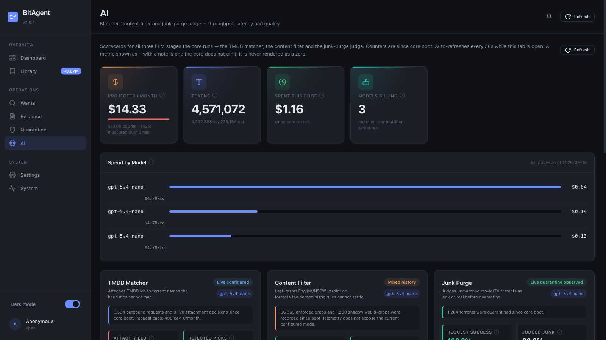

# BitAgent

<p>
  <a href="https://norvitech.com"></a>
  <a href="https://github.com/spencercnorton/bitagent/actions/workflows/ci.yml"></a>
  <a href="https://github.com/spencercnorton/bitagent/releases"></a>
  <a href="LICENSE"></a>
  <a href="https://buy.stripe.com/8x26oH2U44f65TRe574wM04"></a>
</p>

**BitAgent is a self-hosted BitTorrent DHT crawler and indexer built for the \*arr stack.** It crawls the DHT into a Postgres corpus, classifies every torrent it finds, and serves the result to Sonarr, Radarr, Lidarr, Readarr and Prowlarr over Torznab. What makes it different is the loop: it watches what your \*arrs actually grab and import, and feeds that ground truth back into classification, ranking and retention. The core is a hardened Go service; the operator dashboard and the LLM stages ship in the same image and stay off until you turn them on.

<p align="center">
  
</p>

BitAgent started in April 2026 as a fork of [`bitmagnet-io/bitmagnet`](https://github.com/bitmagnet-io/bitmagnet), which has been dormant since July 2025. The DHT crawler, metainfo fetcher, CEL classifier and the Postgres/GraphQL foundation are upstream's work and are credited [below](#lineage--licence). Almost everything else on this page is new — roughly 100K lines of non-test Go, 33 schema migrations and 16 new packages against the baseline. [Compare the baseline with `main`](https://github.com/spencercnorton/bitagent/compare/2b9e8eadd34c037830d1fa7470b5ef2746cd6388...main).

## See it run

<p align="center">
  
</p>

Two containers, no accounts, no API keys. From a clone of this repository:

```sh
cp examples/.env.example examples/.env.public     # set POSTGRES_PASSWORD, nothing else is required
docker compose -f examples/docker-compose.public.yml --env-file examples/.env.public up -d --build
curl -s localhost:3333/metrics | grep dht_crawler_persisted   # climbing within a minute
open http://localhost:8080                                     # the operator console
```

Then add `http://<host>:3333/torznab/` as a Torznab indexer in Prowlarr (or in each \*arr directly — [per-app guides](docs/integrations/sonarr.md)), and point the \*arr's webhook at `/evidence/arr/<instance>` so the evidence loop closes ([`docs/evidence.md`](docs/evidence.md)). A GraphQL playground is served at `/graphql`, Prometheus metrics at `/metrics`, and the quickstart turns the dashboard on at `http://localhost:8080` (loopback only, no login). [`examples/README.md`](examples/README.md) covers the stack in detail; the recording above is that stack on a laptop, and the numbers are what a fresh instance sees in its first few minutes.

## What BitAgent adds

**Ground truth from your \*arr stack.** `POST /evidence/arr/:instance` receives Sonarr/Radarr/Lidarr/Readarr webhooks, a history poller backstops lost deliveries and a qBittorrent poller reads categories and tags. Every signal lands in an append-only `label_evidence` table and resolves, by explicit precedence, into one canonical label per infohash. A label backed by a real grab short-circuits the classifier — nothing to compute — and grab → import outcomes train Beta(α, β) success priors per release feature that re-rank Torznab results toward what has actually worked for you. Liveness derives alive / suspect / dead per infohash from client state and import events, keeps dead swarms out of Torznab and revalidates them through DHT `get_peers`. `bitagent attribution recon` reconstructs, per infohash, what the indexer served, what the client grabbed and what the \*arr imported, so hit-rate claims are measured rather than folklore.

**Curation, not just collection.** A deterministic content filter — language tag or title script, lossy-audio-only music, NSFW, blocked extensions and content types, foreign audio — runs in pure Go with no network or database call per decision and is anime-aware, so watchable anime is never dropped on a script heuristic. Persistently unmatched rows are judged by name and only confident junk moves to a quarantine you can restore from. Retention purges rows with no label, no evidence, zero seeders everywhere and age past `MinAge`, dry-run by default. A pre-fetch bloom filter of double-hashed CSAM infohashes is consulted before any BEP-9 fetch ([`docs/csam-defense.md`](docs/csam-defense.md)), and an append-only verdict ledger feeds Torznab exclusion and crawler triage.

**Titles that actually match.** An LLM-free anime backbone recognises fansub brackets, absolute episode numbers and romaji season markers on the always-on path, backed by an alias table built from AniDB titles joined to Anime-Lists TMDB mappings, so every romaji, kanji, English and fan alias resolves to one TMDB id. TMDB alternative titles and translations are folded into full-text search; `internal/titlenorm` is the single title normaliser every matching surface calls (the repo once had eleven); release granularity, release date, absolute episode and English-audio presence are stamped on every row with resumable backfills; `S01E01E02` and three-digit episode numbers parse correctly.

**Accurate swarm numbers.** A BEP-15 UDP scrape worker refreshes seeders and leechers from public trackers at about seventy infohashes per datagram, replacing the crawler's one-node, never-refreshed estimate. Per-peer BEP-9 history stops the fetcher re-hammering peers that never answer (the audit that motivated it found 8.68M errors against 207K successes). BEP-42 external-IP resolution, BEP-43 read-only handling and BEP-51 peer intervals are implemented on both paths.

**Observability that answers questions.** `bitagent_*` metric families cover every subsystem — DHT server, client and responder, routing table, crawler, classifier, evidence, content filter, liveness, priors, retention, junk purge, seeds, wantbridge and each LLM stage ([`docs/reference/metrics.md`](docs/reference/metrics.md)). `pgstats` reports table and index bloat, autovacuum lag, dead tuples and pool saturation on every scrape. Grafana dashboards and Prometheus / Loki / Pyroscope configs ship in [`observability/`](observability/), and a `bitmagnet_*` dual-emit shim keeps dashboards built against upstream alive.

**Operations.** Every credential accepts a `_FILE` variant, and a missing or empty file is a startup error rather than a silently disabled feature. Every destructive or costly feature has a two-flag opt-in (`Enabled`, then `Enforce` / `EnableLive` / `EnablePurge`) and counterfactual `would_*` metrics, so you read the numbers before you flip the switch. `eval-freeze`, `eval-replay` and `matcher-eval` snapshot corpora and replay them through the real workflow as byte-stable JSONL; every backfill is bounded, resumable and dry-run capable.

The full list, with the design notes behind each item, is [`docs/project/improvements.md`](docs/project/improvements.md).

## LLM integration

Four points in the pipeline can ask a model. All four are **off by default** — without them BitAgent is a fully deterministic indexer — and each speaks to an OpenAI-compatible chat endpoint, hosted or self-hosted (Ollama, vLLM), so the model can live on your own LAN and nothing leaves the house. The matcher can also route through OpenRouter, pinned to one provider with zero-data-retention and no fallback.

| Stage | Runs when | Decides |
|---|---|---|
| **TMDB matcher** (`internal/classifier/llmmatch`) | The rules typed a torrent as movie or TV but neither local search nor TMDB search could attach an id — the releases your \*arrs cannot grab | Two calls: *extract* `{title, year, type, season, episode}` from a mangled name, then *rerank* the TMDB candidates. Told to return nothing when unsure: a wrong match is worse than none |
| **Type fallback** (`internal/classifier/llmstage`) | The rules returned `ErrUnmatched` | `{category, confidence}` from the title, a hash of the file list and a size bucket — never paths or exact sizes |
| **Content-filter tier** (`internal/classifier/contentfilter`) | The residual the deterministic ladder cannot decide | Keep or drop, with confidence. A rule miner turns recurring verdicts into candidate deterministic rules so the model works itself out of a job |
| **Junk judge** (`internal/junkpurge`) | Movie/TV rows still unmatched after `MinAge` | *Real but mangled* versus *junk*, judged on the name alone so a TMDB outage cannot corrupt the verdict. Only confident junk moves to quarantine |

The guardrails are the same across stages. Every stage runs in shadow mode first and emits metrics; going live is a separate switch. Daily and monthly call budgets persist in Postgres, every attempt including failures consumes a slot, and zero means stop, never unlimited. Anything that came from a private tracker never leaves the host, and private infohashes fail closed on a lookup error. Size, file-count and extension gates reject payloads not worth an inference, sha256-keyed caches make repeats free, and the junk judge aborts a cycle without deleting when the provider is unavailable or an implausible share of a batch comes back as junk. Requests and responses are captured for offline scoring.

## What's in the box

| Area | Surface |
|---|---|
| Engine | DHT crawler (BEP-5/9/10/33/42/43/51), metainfo requester with peer reputation, CEL classifier, GORM-backed Postgres persistence |
| External API | `/graphql` (GraphQL), `/torznab/*any` (Torznab with liveness exclusion and priors re-ranking), `/import` |
| Evidence | `POST /evidence/arr/:instance` webhook, \*arr history poller, qBittorrent poller → `label_evidence`, `torrent_canonical_labels`, liveness, priors |
| Classification | canonical preempt → CEL rules → optional LLM fallback; anime backbone; alternative titles; one title normaliser |
| Curation | content filter, junk purge with quarantine, retention, CSAM pre-fetch blocklist, verdict ledger, queue cleaner |
| LLM stages | TMDB matcher, type fallback, content-filter tier, junk judge — all opt-in, budgeted, shadow-first |
| Swarm data | BEP-15 tracker scrape, seeds history, revalidation via DHT |
| Metrics | `bitagent_*` Prometheus families, `pgstats`, `dashstats`, Grafana dashboards in `observability/`, legacy `bitmagnet_*` dual-emit |
| Dashboard | the `ui` worker: operator console + public library in the same image, off until `UI_ENABLED=true` — [`ui/README.md`](ui/README.md) |
| CLI | `worker`, `classifier`, `reprocess`, `attribution`, `eval-freeze` / `eval-replay` / `matcher-eval` / `batch-llm-match`, backfills — see [`docs/reference/cli.md`](docs/reference/cli.md) |

## The dashboard

The operator console and public library ship inside the BitAgent image as the worker `ui`: a small FastAPI app under [`ui/`](ui/) that the Go core starts, supervises and restarts with backoff, whose logs flow into the core's own log stream, and which reads the core over GraphQL and Prometheus on `127.0.0.1:3333` and never writes to the corpus. It is **off by default** (`UI_ENABLED=false`), so a crawler stays headless unless you ask; the quickstart stack turns it on and serves it at `http://localhost:8080`. On an existing deployment, set `UI_ENABLED=true`, publish port 8080, mount a volume at `/data` for its SQLite file and recreate the container — or run it on its own with `UI_ENABLED=true bitagent worker run --keys ui` (the core-side keys are in [`docs/configuration.md`](docs/configuration.md), the UI's own in [`ui/README.md`](ui/README.md)).

<p align="center">
  
</p>
<p align="center">
  
  
</p>

One app serves two hostnames. The **operator console** shows indexer win rate, match rate, grab liveness, evidence per source, a quarantine you can spot-check, one scorecard per LLM stage with spend against a budget, a read-only view of the running configuration, a search tester and a GraphQL explorer. The **public library** is for the people you share the indexer with: poster browse and search, and a personal Torznab key per user, stored hashed and rate-limited, so nobody sees the core's credential. `OPERATOR_HOSTS` and `PUBLIC_LIBRARY_HOSTS` select the surface; only a verified role grants operator authority. The quickstart runs with `REQUIRE_AUTH=false`, fine on your own machine and never on anything someone else can reach — the real tiers (`DASHBOARD_API_KEY`, or a reverse proxy that performs the login and injects identity with a proof header) are documented in [`ui/README.md`](ui/README.md); the tabs are walked through in [`docs/ui-guide.md`](docs/ui-guide.md). The captures above come from the console running against [`ui/tools/demo_core.py`](ui/tools/demo_core.py), a stand-in core with synthetic release data and real TMDB IDs for the poster-matching demo.

## Documentation

- [Docs index](docs/index.md) · [Quickstart](docs/quickstart.md) · [Configuration](docs/configuration.md) · [FAQ](docs/faq.md) · [Troubleshooting](docs/troubleshooting.md)
- Concepts: [Architecture](docs/concepts/architecture.md) · [DHT crawler](docs/concepts/dht-crawler.md) · [Classification](docs/concepts/classification.md) · [Wantbridge](docs/concepts/wantbridge.md) · [Glossary](docs/concepts/glossary.md)
- Reference: [Torznab API](docs/reference/torznab-api.md) · [GraphQL API](docs/reference/graphql-api.md) · [Dashboard guide](docs/ui-guide.md) · [Dashboard module](ui/README.md) · [Metrics](docs/reference/metrics.md) · [CLI](docs/reference/cli.md)
- Operations: [Security](docs/operations/security.md) · [Monitoring](docs/operations/monitoring.md) · [Private tracker mode](docs/integrations/private-tracker-mode.md) · [CSAM defence](docs/csam-defense.md)
- Project: [Improvements over upstream](docs/project/improvements.md) · [Legal disclaimer](docs/legal/disclaimer.md)

## Development

```sh
git clone https://github.com/spencercnorton/bitagent.git
cd bitagent

go test ./...                        # vanilla suite, CGO off
CGO_ENABLED=1 go test -race ./...    # race-detector suite
go build .                           # produces ./bitagent

# the dashboard on its own (see ui/README.md for the env it reads):
cd ui && python3.12 -m venv .venv && . .venv/bin/activate && pip install --require-hashes -r requirements.lock
REQUIRE_AUTH=false python -m uvicorn app:app --no-proxy-headers --port 8080
cd ..

# run against a real Postgres:
POSTGRES_HOST=localhost POSTGRES_PASSWORD=bitagent ./bitagent worker run --all
```

Contributions are welcome — read [CONTRIBUTING.md](CONTRIBUTING.md) first. This repository is a release mirror: pull requests are reviewed here and ship in the next tagged release.

## Support

- Bugs and feature requests: [open an issue](https://github.com/spencercnorton/bitagent/issues/new/choose). Questions: [Discussions](https://github.com/spencercnorton/bitagent/discussions).
- Security: [private vulnerability reporting](https://github.com/spencercnorton/bitagent/security/advisories/new) — see [SECURITY.md](SECURITY.md).
- If BitAgent earns a place in your stack, you can [support its development](https://buy.stripe.com/8x26oH2U44f65TRe574wM04).

## Lineage & licence

Licensed under the MIT licence, inherited from [`bitmagnet-io/bitmagnet`](https://github.com/bitmagnet-io/bitmagnet). All upstream copyright notices are preserved, and the parts that are still upstream's — the DHT protocol implementation, metainfo fetching, the CEL classifier engine and the GraphQL/Postgres foundation — are the reason the rest was possible.

BitAgent's baseline is upstream commit `2b9e8ea`, the head of upstream `main` from July 2025 until May 2026. The fork was cut in April 2026 and stopped tracking upstream on a schedule at the rebrand that month; the `upstream` remote stays configured for security-fix surveillance.

The diagram and the recording on this page live in [`docs/assets/`](docs/assets/); the recording is an animated PNG captured from the quickstart stack on a laptop with a fresh database, and every number in it is what that instance reported.

---

<p align="center">
  <a href="https://norvitech.com"></a>
</p>

<p align="center">
  <a href="https://github.com/spencercnorton/helios">Helios</a> ·
  <a href="https://github.com/spencercnorton/bitagent">BitAgent</a> ·
  <a href="https://github.com/spencercnorton/xnote">XNote</a> ·
  <a href="https://github.com/spencercnorton/xnote-placement">XNote Placement</a> ·
  <a href="https://norvitech.com">norvitech.com</a>
</p>
