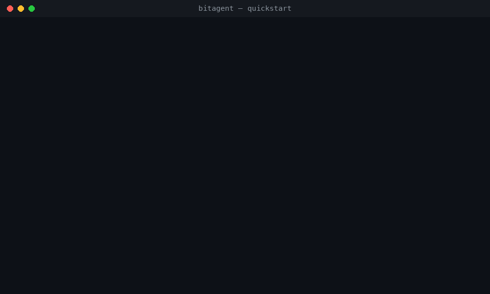

# BitAgent deployment and operations

BitAgent combines the Go indexer with an optional Python operator console.
The public Compose stack builds from this repository and stores catalog
state in PostgreSQL. Optional LLM stages are explicitly configured features;
installing the application is not evidence that those stages are active.

## Install the reproducible public stack

Use Docker and Compose with persistent disk, sufficient database capacity and
UDP network access for DHT. Start with a small deployment and measure memory,
disk growth and crawl rate before sizing a larger instance.

```bash
git clone https://github.com/spencercnorton/bitagent.git
cd bitagent
cp examples/.env.example examples/.env.public
openssl rand -hex 32   # POSTGRES_PASSWORD
openssl rand -hex 32   # TORZNAB_API_KEY
```

Put the two values in `examples/.env.public`, then:

```bash
docker compose -f examples/docker-compose.public.yml --env-file examples/.env.public config --quiet
docker compose -f examples/docker-compose.public.yml --env-file examples/.env.public up -d --build
docker compose -f examples/docker-compose.public.yml --env-file examples/.env.public ps
curl --fail http://localhost:3333/metrics
```

The console is at `http://localhost:8080`; the example binds it to loopback and
uses no login. Keep that binding for initial setup. Place authentication and
TLS in front of any exposed console. Review the core's separate API bindings;
a loopback console does not make another published port private.



## Configure integrations

| Area | Configure and verify |
|---|---|
| PostgreSQL | Required password, persistent volume, disk capacity and backup |
| DHT | UDP access and routing; verify peers and persisted-torrent metrics |
| Torznab | Set a key; test capabilities before adding an indexer to an *arr app |
| Console | `UI_ENABLED`; authenticated access when exposed outside loopback |
| Metadata | Your own provider key; verify provider quota and error handling |
| LLM workflows | Explicit keys, budgets, modes and independent evaluation |

Use [configuration](configuration.md) as the setting reference. Connect Sonarr,
Radarr or Prowlarr using an address reachable from their own container/network,
not blindly `localhost`. Follow [the quickstart](quickstart.md) for the exact
public Compose layout and [UI guide](ui-guide.md) for console behavior.

## Security and data handling

Do not expose PostgreSQL. Protect Torznab with its API key and review GraphQL,
metrics and evidence-webhook exposure independently. Keep API keys in an
ignored environment file or a secret manager; do not paste Compose-rendered
configuration into an issue.

Real torrent names, acquisition history and evaluation rows may identify a
person. Use generated records for screenshots and tests. Publish aggregate
benchmarks only when their measurement procedure and limits are clear. Do
not enable destructive classification or purge modes without independently
reviewed evidence and a tested recovery path.

## Health, capacity and verification

Verify both services are healthy, metrics remain reachable and the persisted
counter changes after bootstrap. Use the console's System health checks and
check database disk growth, queue depth and provider errors. An empty search
immediately after startup can reflect DHT warmup; repeated empty results need
network and worker checks rather than an assumed fixed startup duration.

Test Torznab capabilities and one synthetic integration request before
connecting an entire automation stack. Test LLM stages with their budgets and
shadow/evaluation modes before accepting live verdicts.

## Backup, upgrades and restore

Back up PostgreSQL, operator configuration and any additional persistent state
listed in your deployment. Save secrets separately in an encrypted backup.
Rehearse restoration into an isolated database with external API calls and
DHT traffic disabled until the recovered settings have been reviewed.

Record the release version and image digest before upgrading. Build from an
immutable public tag; verify service health, migrations, API compatibility,
crawl progress and UI behavior afterward. Restore the matching database
backup when a migration makes a binary-only downgrade unsafe.

## Troubleshooting

| Symptom | Check and next action |
|---|---|
| No DHT progress | Check UDP access, bootstrap peers and worker enablement. |
| Database restarts or workers stall | Check disk, memory, PostgreSQL health and connection limits. |
| Torznab returns 401 | Compare the configured key with the caller's key privately. |
| *arr cannot connect | Test reachability from its network; check the host/port and API path. |
| Console is unavailable | Check UI_ENABLED, the worker, port binding and reverse-proxy configuration. |
| LLM feature appears inert | Check mode, key, budget and actual workflow metrics. |

See [troubleshooting](troubleshooting.md), [monitoring](operations/monitoring.md)
and [security](operations/security.md) for the detailed operational references.
