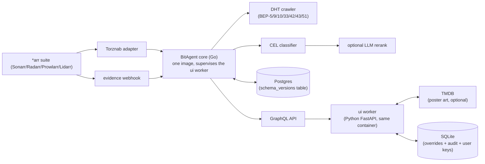

# Architecture

## System overview

BitAgent is a self-hosted indexer engineered for high-throughput metadata correlation and torrent discovery. One repo and one image hold two processes: the Go core, which owns the indexing engine, networking stack, and protocol adapters; and the Python dashboard under `ui/`, which the core runs as the worker `ui` (off by default, `UI_ENABLED=true` to start it) for monitoring, posters, and the public library.

The core operates as a stateful indexing service that bridges external client suites (Sonarr/Radarr/Prowlarr/Lidarr), exposes a GraphQL API, and persists discovered assets to PostgreSQL. The dashboard is a thin presentation layer communicating with the GraphQL and Prometheus endpoints on `127.0.0.1:3333` and a local SQLite file for its own state (settings overrides, audit log, block phrases, notifications, hashed user API keys).

BitAgent is a 2026 fork of upstream `bitmagnet-io/bitmagnet` (which went dormant July 2025). We carried forward the DHT primitives and core indexing engine; we diverged with a redesigned classification pipeline, decoupled evidence ingestion, a supervised dashboard with its own auth tiers, and stricter runtime boundaries.

## Architecture diagram

The same flow with the dashboard and its SQLite file drawn in:

## Component walkthrough

**DHT crawler** — Strict compliance with BEP-5, BEP-9, BEP-10, BEP-33, BEP-42, BEP-43, BEP-51. Maintains a dynamic peer table sized to available RAM; bootstraps from a deterministic node list with DHT fallback after the first gossip cycle. Periodically refreshes the routing table and applies exponential backoff during failure bursts. UDP sockets bind to ephemeral ranges; packet TTLs limit DHT amplification.

**Torznab adapter** — Protocol boundary for the *arr ecosystem. Implements the full Torznab caps endpoint, exposing supported search modes (`tv-search`, `movie-search`, `music-search`, `book-search`) and category mappings aligned with Newznab standards. Validates `TORZNAB_API_KEY` per request via constant-time compare; rate limits per client; serves XML responses with full metadata.

**CEL classifier** — Evaluates torrent metadata against a compiled CEL policy. Rules execute in a deterministic priority order; a high-confidence ground-truth match (from the evidence pipeline) preempts the rule chain entirely. When the rule chain is exhausted without a definitive label, an optional LLM rerank gate triggers and feeds structured metadata to a model for semantic disambiguation. Final score is cached and indexed for GraphQL exposure.

**Evidence pipeline** — Ingests webhook payloads from Sonarr/Radarr (`POST /evidence/arr/<instance>`). Successful download events propagate ground-truth labels backward to the originating evidence record; failures apply penalty weights. The pipeline deduplicates rapid bursts, normalises timestamp formats across *arr versions, and runs asynchronously to keep webhook latency low.

**Postgres data layer** — Managed via GORM. Schema versions tracked in a `schema_versions` table; migrations are forward-only. Core tables: `torrents` (global asset registry), `releases` (versioned metadata snapshots), `evidence` (webhook events), `wants` (operator-defined search targets). Indexes optimise lookups on infohash, category, and classification timestamp.

**GraphQL API** — Primary query surface. Authenticated at the middleware layer with scoped tokens. Common queries: `searchTorrents`, `getReleaseDetails`, `listEvidenceEvents`, `updateWants`. Resolvers fetch from cache or Postgres and apply real-time classification adjustments before serializing.

**ui worker** — FastAPI + vanilla-JS frontend under `ui/`, spawned as a uvicorn child by the core when `UI_ENABLED=true` (or alone with `worker run --keys ui`, still gated on `UI_ENABLED`), restarted with backoff if it dies, its stdout/stderr folded into the core's log stream. A three-tier auth resolver (`DASHBOARD_API_KEY` → `X-Auth-User-Id` from a trusted proxy → `X-Forwarded-User` from a trusted proxy, each proxy tier requiring both a trusted peer CIDR and a proof header) gates every endpoint; it validates no passwords or session cookies itself. Read-only relative to BitAgent core: never mutates indexing data. All data fetches route through the GraphQL API.

**Settings persistence** — SQLite at `/data/bitagent-ui.db` (mount a volume there). Only the integration credentials in `MUTABLE_FIELDS` (`ui/config.py`) can be overridden from the UI; host lists, proxy trust and the upstream URLs are startup-only. Every change writes an audit row (key, old, new, actor, timestamp) with secrets stored as `[redacted]`. Overrides apply on the next request — no process restart needed.

## Why two processes in one image

The Go core owns indexing, DHT networking, classification, and persistence — built for performance and strict concurrency. The dashboard under `ui/` is Python: FastAPI routing, Jinja templates, vanilla JS and one SQLite file — optimised for rapid iteration. Two languages, so two processes; one product, so one repo, one image and one tag series. The core supervises the child the way it runs every other worker: `worker run --all` starts it when `UI_ENABLED=true`, `worker run --keys ui` runs it alone (the flag still gates it), shutdown stops it, and a crash restarts it with backoff.

A hard scope boundary survives the fold: the UI is read-only relative to BitAgent state. It never mutates indexing data, triggers crawls, or rewrites classifier rules directly. All structural changes flow through the GraphQL API, ensuring auditability and preventing cross-component drift.

Off by default. A crawler-only deployment leaves `UI_ENABLED` unset and never starts a Python process; the quickstart compose turns it on.

## Data flow examples

**Torrent discovered via DHT.** The crawler resolves an announce, fetches metainfo via BEP-9 from peers, hands the parsed metadata to the CEL classifier. Rules evaluate; ground-truth-evidence preempts; if unresolved, the optional LLM gate runs. The core persists to Postgres, updates `releases`, exposes via GraphQL. On Torznab query, the adapter assembles the magnet URI and metadata response.

**Sonarr requests an episode.** Sonarr's poll triggers `GET /torznab?t=tvsearch&q=...&season=...&ep=...&apikey=$KEY`. The adapter normalises params and queries the core's search graph against Postgres. Results are ranked by classifier confidence + evidence score + release freshness. Top matches serialise to Torznab XML; Sonarr selects, downloads, and emits an evidence webhook closing the feedback loop.

**Operator changes a setting.** Dashboard form → `PUT /api/settings/overrides/<key>` (auth required). FastAPI validates the field is in the `MUTABLE_FIELDS` allowlist, writes to SQLite, appends an audit row. Next request reads the override via the custom `pydantic-settings` source — no restart.
