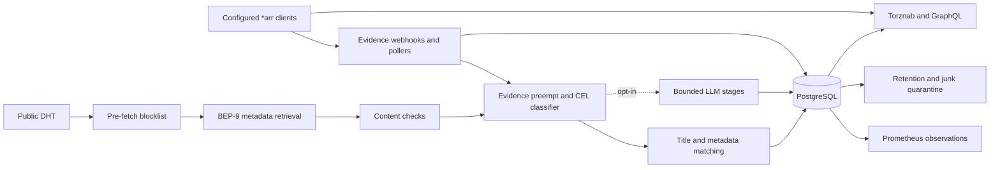

# Backend architecture

BitAgent is a standalone Go service derived from
[bitmagnet](https://github.com/bitmagnet-io/bitmagnet). It owns DHT networking,
metadata retrieval, classification, matching, filtering, cleanup, evidence and
PostgreSQL persistence. Its public container and source tree contain the backend
and machine API adapters. Any browser client runs as an independent service.

## Processing flow

```mermaid
flowchart LR
  DHT[Public DHT] --> Blocklist[Pre-fetch blocklist]
  Blocklist --> Fetch[BEP-9 metadata retrieval]
  Fetch --> Filter[Content checks]
  Filter --> Classifier[Evidence preempt and CEL classifier]
  Classifier --> Match[Title and metadata matching]
  Match --> PG[(PostgreSQL)]
  Classifier -. opt-in .-> LLM[Bounded LLM stages]
  LLM --> PG
  PG --> APIs[Torznab and GraphQL]
  Clients[Configured *arr clients] --> APIs
  Clients --> Evidence[Evidence webhooks and pollers]
  Evidence --> PG
  Evidence --> Classifier
  PG --> Cleanup[Retention and junk quarantine]
  PG --> Metrics[Prometheus observations]
```

## Boundaries

The DHT crawler discovers public infohashes, applies the blocklist before
metadata retrieval, and sends recovered metainfo through processing. Labels
backed by evidence can preempt the classifier. Deterministic title normalization
and provider matching enrich the corpus; optional LLM stages retain separate
shadow/live gates and budgets.

PostgreSQL stores the corpus, evidence and processing state. Go migrations
travel with backend releases. Retention and junk quarantine are backend work,
with explicit opt-in and dry-run controls. Generic source adapters are configured
with your own endpoints and credentials; no particular hardware is required.

The HTTP worker serves JSON `POST /graphql`, Torznab, metrics, import and
evidence endpoints on the backend API port. GraphQL includes privileged mutation
operations and has no built-in human login. Protect these routes with a trusted
service network or independent proxy authentication. Torznab and evidence have
their own configurable keys; those keys do not authorize all other routes.

Presentation, account sessions, memberships, invitations, site-specific catalogs
and site deployments have a separate lifecycle. Backend releases do not ship
those components or consume their databases. A site client talks to GraphQL and
metrics across the service boundary, and can update independently when the API
contract remains compatible.

## Interfaces and verification

Use [GraphQL](../reference/graphql-api.md) for corpus and worker operations,
[Torznab](../reference/torznab-api.md) for indexer clients,
[metrics](../reference/metrics.md) for observations and
[CLI](../reference/cli.md) for local operations. CI runs Go race tests, database
regressions, public-content checks and source/image distribution guards.
See [4.0 migration](../migration-v4.md) for combined-image upgrades.
